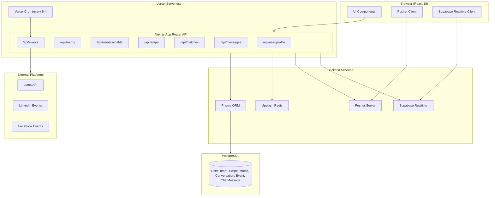
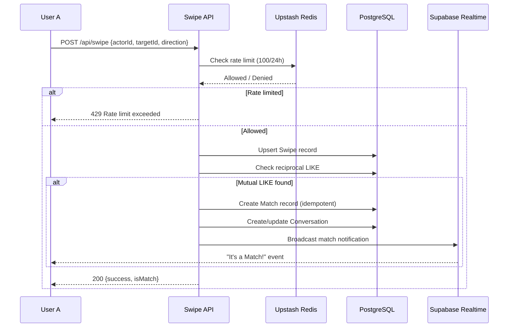

# Design Document: Hackathon Matcher

## Overview

Hackathon Matcher is a "Tinder-style" teammate discovery platform built on the existing Next.js + Prisma + PostgreSQL stack. It extends the current MVP (which supports basic swiping and messaging) into a full-featured matching engine with skill-based ranking, team matching workflows, event aggregation, real-time notifications, and rate limiting.

### Key Design Decisions

1. **Explicit Match model**: The existing system derives matches implicitly from reciprocal swipes. This design introduces an explicit `Match` model to support idempotent match creation, efficient conversation lookup, and match history queries without scanning the entire Swipe table.

2. **Conversation model with participants**: Replace the bare `chatId` string with a proper `Conversation` model and `ConversationParticipant` join table, enabling access control, group chats for teams, and participant management.

3. **Event schema extension**: Extend the minimal `Event` model with `sourcePlatform`, `sourceId`, and `sourceUrl` fields plus a composite unique index for deduplication across platforms.

4. **Skill Complementarity as a pure function**: The scoring algorithm is implemented as a stateless pure function (`computeSkillComplementarity`) that takes two profiles as input and returns a score in [0, 1]. This enables property-based testing and caching.

5. **Vercel Cron for event aggregation**: Use Vercel Cron Jobs (via `vercel.json` cron config) to trigger the Event_Aggregator every 6 hours, keeping the architecture serverless.

6. **Upstash Redis for rate limiting**: Wire the existing Upstash Redis infrastructure into swipe and messaging endpoints using sliding window rate limiters.

## Architecture



### Data Flow: Swipe and Match



## Components and Interfaces

### 1. Profile Service (`/api/user/profile`, `/api/teams`)

**Responsibilities**: User and team CRUD with validation.

```typescript
// POST /api/user/profile
interface ProfileUpdateRequest {
  email: string;
  name: string;           // 1-100 chars
  university?: string;    // max 100 chars
  course?: string;        // max 100 chars
  skills: string[];       // 1-15 items, each 1-30 chars
  interests: string[];    // 1-10 items, each 1-30 chars
  image?: string;
}

// POST /api/teams
interface TeamCreateRequest {
  name: string;           // 1-50 chars
  description?: string;   // 0-300 chars
  skillsNeeded: string[]; // 0-10 items, each 1-30 chars
}

// PUT /api/teams/[teamId]
interface TeamUpdateRequest {
  name?: string;
  description?: string;
  skillsNeeded?: string[];
}
```

### 2. Matching Engine (`/api/user/swipable`, `/api/swipe`)

**Responsibilities**: Discovery stack generation, swipe recording, match detection.

```typescript
// GET /api/user/swipable?email=...&eventId=...
interface SwipableResponse {
  cards: SwipableCard[];      // max 20 per batch
  hasMore: boolean;
}

interface SwipableCard {
  type: "USER" | "TEAM";
  id: string;
  name: string;
  skills: string[];
  interests?: string[];
  skillsNeeded?: string[];      // teams only
  members?: TeamMemberInfo[];   // teams only
  complementarityScore: number; // 0.0 to 1.0
}

// POST /api/swipe
interface SwipeRequest {
  actorId: string;
  targetUserId?: string;
  targetTeamId?: string;
  targetType: "USER" | "TEAM";
  direction: "LIKE" | "PASS";
}

interface SwipeResponse {
  success: boolean;
  isMatch: boolean;
  matchId?: string;
  error?: string;
}
```

### 3. Skill Complementarity Scorer (`lib/scoring.ts`)

**Responsibilities**: Pure function computing compatibility scores.

```typescript
// lib/scoring.ts
export function computeUserToTeamScore(
  userSkills: string[],
  teamSkillsNeeded: string[]
): number;

export function computeUserToUserScore(
  userASkills: string[],
  userAInterests: string[],
  userBSkills: string[],
  userBInterests: string[]
): number;
```

**User-to-Team formula**: `|userSkills ∩ teamSkillsNeeded| / |teamSkillsNeeded|`
- If `teamSkillsNeeded` is empty → returns 0.0

**User-to-User formula**: `0.4 * sharedInterestRatio + 0.6 * complementarySkillRatio`
- `sharedInterestRatio` = `|interestsA ∩ interestsB| / |interestsA ∪ interestsB|`
- `complementarySkillRatio` = `|skillsA Δ skillsB| / |skillsA ∪ skillsB|` (symmetric difference / union)
- If both arrays empty → returns 0.0

### 4. Notification Service (Supabase Realtime + Pusher)

**Responsibilities**: Real-time match notifications and chat message delivery.

```typescript
// Match notification via Supabase Realtime
interface MatchNotificationPayload {
  matchId: string;
  matchType: "USER_TO_USER" | "USER_TO_TEAM";
  participants: { id: string; name: string }[];
  conversationId: string;
}

// Chat message via Pusher (low-latency)
interface ChatMessagePayload {
  id: string;
  chatId: string;
  senderId: string;
  senderName: string;
  content: string;
  createdAt: string;
}
```

**Design Decision**: Use Pusher for chat messages (lower latency, connection-oriented) and Supabase Realtime for match notifications (broadcast to potentially offline users, with persistence).

### 5. Event Aggregator (`/api/events/aggregate`)

**Responsibilities**: Scheduled collection of hackathon events from external sources.

```typescript
// Internal - triggered by Vercel Cron
interface AggregatedEvent {
  name: string;
  description?: string;
  date: Date;
  location?: string;
  sourceUrl: string;
  sourcePlatform: "LUMA" | "LINKEDIN" | "FACEBOOK";
  sourceId: string;         // platform-specific event ID
}

// GET /api/events?page=1&limit=20
interface EventListResponse {
  events: Event[];
  totalCount: number;
  page: number;
  hasMore: boolean;
}
```

### 6. Rate Limiter (`lib/rate-limit.ts`)

**Responsibilities**: Sliding window rate limiting for swipes and messages.

```typescript
// lib/rate-limit.ts
import { Ratelimit } from "@upstash/ratelimit";
import { redis } from "./redis";

export const swipeRateLimit = new Ratelimit({
  redis,
  limiter: Ratelimit.slidingWindow(100, "24h"),
  prefix: "ratelimit:swipe",
});

export const messageRateLimit = new Ratelimit({
  redis,
  limiter: Ratelimit.slidingWindow(50, "60m"),
  prefix: "ratelimit:message",
});
```

## Data Models

### Schema Changes (Prisma)

```prisma
// === NEW MODELS ===

model Match {
  id             String   @id @default(cuid())
  matchType      String   // "USER_TO_USER" or "USER_TO_TEAM"
  userAId        String
  userBId        String?  // null for user-to-team matches
  teamId         String?  // null for user-to-user matches
  conversationId String
  createdAt      DateTime @default(now())

  userA          User     @relation("MatchUserA", fields: [userAId], references: [id], onDelete: Cascade)
  userB          User?    @relation("MatchUserB", fields: [userBId], references: [id], onDelete: Cascade)
  team           Team?    @relation(fields: [teamId], references: [id], onDelete: Cascade)
  conversation   Conversation @relation(fields: [conversationId], references: [id])

  @@unique([userAId, userBId, teamId])
  @@index([userAId])
  @@index([userBId])
}

model Conversation {
  id           String   @id @default(cuid())
  type         String   // "DIRECT" or "GROUP"
  teamId       String?  @unique  // link to team for group chats
  createdAt    DateTime @default(now())

  participants ConversationParticipant[]
  messages     ChatMessage[]
  matches      Match[]
  team         Team?    @relation(fields: [teamId], references: [id])
}

model ConversationParticipant {
  id             String   @id @default(cuid())
  conversationId String
  userId         String
  joinedAt       DateTime @default(now())

  conversation Conversation @relation(fields: [conversationId], references: [id], onDelete: Cascade)
  user         User         @relation(fields: [userId], references: [id], onDelete: Cascade)

  @@unique([conversationId, userId])
}

model EventInterest {
  id      String @id @default(cuid())
  userId  String
  eventId String

  user  User  @relation(fields: [userId], references: [id], onDelete: Cascade)
  event Event @relation(fields: [eventId], references: [id], onDelete: Cascade)

  @@unique([userId, eventId])
}

// === MODIFIED MODELS ===

model Event {
  id             String   @id @default(cuid())
  name           String
  description    String?
  date           DateTime
  location       String?
  url            String?
  sourcePlatform String?  // "LUMA" | "LINKEDIN" | "FACEBOOK"
  sourceId       String?  // platform-specific ID for dedup
  createdAt      DateTime @default(now())

  interests EventInterest[]

  @@unique([name, date])       // deduplication index
  @@index([date])              // for future event queries
}

model ChatMessage {
  id             String   @id @default(cuid())
  conversationId String   // FK to Conversation (replaces bare chatId)
  chatId         String   // kept for backward compatibility
  senderId       String
  content        String   @db.VarChar(2000)
  createdAt      DateTime @default(now())

  conversation Conversation @relation(fields: [conversationId], references: [id], onDelete: Cascade)
  sender       User         @relation("SentMessages", fields: [senderId], references: [id], onDelete: Cascade)

  @@index([conversationId, createdAt])
}

// User model additions (relations):
// - matchesAsA  Match[] @relation("MatchUserA")
// - matchesAsB  Match[] @relation("MatchUserB")
// - conversations ConversationParticipant[]
// - eventInterests EventInterest[]

// Team model additions (relations):
// - matches Match[]
// - conversation Conversation?
```

### Migration Strategy

1. Add new models (`Match`, `Conversation`, `ConversationParticipant`, `EventInterest`) with no breaking changes.
2. Add new fields to `Event` (nullable `sourcePlatform`, `sourceId`).
3. Add `conversationId` to `ChatMessage` as nullable initially.
4. Run data migration to create `Conversation` records from existing distinct `chatId` values, populate `conversationId` on existing messages, then make it required.
5. Keep `chatId` field for backward compatibility during transition.

### Redis Key Schema

```
ratelimit:swipe:{userId}         — Sliding window counter (100/24h)
ratelimit:message:{userId}:{conversationId} — Sliding window counter (50/60m)
cache:stack:{userId}:{eventId?}  — Cached discovery stack (TTL 30s)
aggregator:lastRun:{platform}    — Timestamp of last successful aggregation
aggregator:failures:{platform}   — Failure count for circuit breaking
```


## Correctness Properties

*A property is a characteristic or behavior that should hold true across all valid executions of a system — essentially, a formal statement about what the system should do. Properties serve as the bridge between human-readable specifications and machine-verifiable correctness guarantees.*

### Property 1: Profile validation accepts valid inputs and rejects invalid inputs

*For any* profile submission where the name is between 1 and 100 characters, skills array has 1–15 items (each 1–30 chars), and interests array has 1–10 items (each 1–30 chars), the Profile_Service SHALL accept and persist the profile. *For any* profile submission that violates any of these constraints (empty name, name > 100 chars, empty skills array, skills > 15 items, empty interests array, interests > 10 items, any individual skill/interest > 30 chars or empty), the Profile_Service SHALL reject the submission.

**Validates: Requirements 1.2, 1.3, 1.5, 1.6**

### Property 2: Team validation accepts valid inputs and rejects invalid inputs

*For any* team creation request where the name is 1–50 characters, description is 0–300 characters, and skillsNeeded has 0–10 items (each 1–30 chars), the Profile_Service SHALL accept and create the team with the creator assigned the LEAD role. *For any* request violating these constraints, the Profile_Service SHALL reject the request.

**Validates: Requirements 2.1, 2.5, 2.7**

### Property 3: Skill complementarity score is correctly computed and bounded

*For any* pair of non-empty skill/interest arrays, the `computeUserToTeamScore(userSkills, teamSkillsNeeded)` SHALL equal `|userSkills ∩ teamSkillsNeeded| / |teamSkillsNeeded|`, and `computeUserToUserScore(skillsA, interestsA, skillsB, interestsB)` SHALL equal `0.4 * (|interestsA ∩ interestsB| / |interestsA ∪ interestsB|) + 0.6 * (|skillsA Δ skillsB| / |skillsA ∪ skillsB|)`. Both functions SHALL return a value in the range [0.0, 1.0]. When the denominator arrays are empty, the function SHALL return 0.0.

**Validates: Requirements 9.1, 9.2, 9.3, 9.4**

### Property 4: Discovery stack excludes already-swiped targets and self

*For any* authenticated user, the Discovery_Stack SHALL never contain the user's own profile, any team where the user is a member, or any user/team that the user has previously swiped on (in either LIKE or PASS direction).

**Validates: Requirements 3.3, 3.4**

### Property 5: Discovery stack is sorted by descending complementarity score and bounded to 20

*For any* Discovery_Stack output, the cards SHALL be sorted in non-increasing order of their Skill_Complementarity score, and the total number of cards SHALL not exceed 20.

**Validates: Requirements 3.1, 3.2, 9.6**

### Property 6: Event hub filter restricts stack to event participants

*For any* Discovery_Stack generated with an Event_Hub filter active, every card in the stack SHALL correspond to a user or team that has registered interest in the selected event.

**Validates: Requirements 3.5**

### Property 7: Swipe persistence correctness

*For any* valid swipe action (valid actorId, valid targetUserId/targetTeamId, direction in {LIKE, PASS}), the Matching_Engine SHALL create a Swipe record with the exact actorId, target, targetType, and direction provided in the request.

**Validates: Requirements 4.1, 4.2, 4.5**

### Property 8: Swipe idempotence (duplicate rejection)

*For any* user who has already swiped on a given target, a subsequent swipe attempt on that same target SHALL be rejected, and the existing Swipe record SHALL remain unchanged.

**Validates: Requirements 4.3**

### Property 9: Reciprocal LIKE creates exactly one Match

*For any* pair (user A, target B) where target B is a user or team, if both A has swiped LIKE on B and B (or B's Team_Lead) has swiped LIKE on A, the Matching_Engine SHALL produce exactly one Match record between them. Repeated swipes or re-processing SHALL not create additional Match records.

**Validates: Requirements 5.1, 6.2**

### Property 10: No match without reciprocity

*For any* swipe where user A swipes LIKE on target B, if B has not swiped LIKE on A (B swiped PASS or has not swiped at all), the Matching_Engine SHALL NOT create a Match record.

**Validates: Requirements 5.4, 6.6**

### Property 11: Conversation ID symmetry

*For any* two user IDs (a, b), the derived chatId SHALL be identical regardless of which user initiated the match: `deriveChatId(a, b) === deriveChatId(b, a)`.

**Validates: Requirements 5.3**

### Property 12: User-to-team match adds member and grants conversation access

*For any* User-to-Team Match created between a user and a team, the user SHALL be added to the team's member list with MEMBER role, AND the user SHALL be added as a participant to the team's group Conversation.

**Validates: Requirements 6.3, 6.5**

### Property 13: Conversation access control

*For any* user who is NOT a participant in a given Conversation, all requests to read messages from or send messages to that Conversation SHALL be rejected with an access-denied error.

**Validates: Requirements 7.4**

### Property 14: Message ordering and pagination

*For any* Conversation containing N messages, loading the Conversation SHALL return exactly min(N, 50) messages, and those messages SHALL be in strictly ascending chronological order (by createdAt timestamp).

**Validates: Requirements 7.3**

### Property 15: Message content validation

*For any* message with empty content (zero characters or whitespace-only) or content exceeding 2000 characters, the Notification_Service SHALL reject the message. *For any* message with content between 1 and 2000 non-whitespace characters, the message SHALL be accepted and persisted.

**Validates: Requirements 7.6**

### Property 16: Event deduplication by name and date

*For any* set of events collected from multiple platforms, if two or more events share the same name (case-insensitive) and the same date, the Event_Aggregator SHALL store exactly one Event record for that (name, date) pair.

**Validates: Requirements 8.2**

### Property 17: Future events sorted ascending and paginated

*For any* event list request, all returned events SHALL have a date strictly in the future, SHALL be sorted in ascending date order, and each page SHALL contain at most 20 events.

**Validates: Requirements 8.3**

### Property 18: Swipe rate limit enforcement

*For any* user who has recorded 100 swipes within the current 24-hour rolling window, any subsequent swipe attempt SHALL be rejected without recording a new Swipe, until the earliest swipe in the window expires.

**Validates: Requirements 10.1, 10.3**

### Property 19: Message rate limit enforcement

*For any* user who has sent 50 messages within the current 60-minute rolling window in a given Conversation, any subsequent message send attempt in that Conversation SHALL be rejected without persisting or delivering the message.

**Validates: Requirements 10.4**

## Error Handling

### API Error Response Format

All API endpoints use a consistent error response:

```typescript
interface ErrorResponse {
  error: string;          // Human-readable error message
  code?: string;          // Machine-readable error code (e.g., "RATE_LIMITED")
  details?: Record<string, string>; // Field-level validation errors
  retryAfter?: number;    // Seconds until action can be retried (rate limits)
}
```

### Error Categories

| Category | HTTP Status | Behavior |
|----------|-------------|----------|
| Validation Error | 400 | Return field-specific error messages |
| Authentication Required | 401 | Redirect to sign-in |
| Access Denied | 403 | Return "not a participant" or "not team lead" |
| Not Found | 404 | Return "target not found" for invalid swipe targets |
| Conflict | 409 | Duplicate swipe attempts |
| Rate Limited | 429 | Return `retryAfter` timestamp |
| Server Error | 500 | Log error, return generic message, preserve client state |

### Specific Error Scenarios

1. **Profile save failure**: API returns 500 with error message. Client preserves form state for retry.
2. **Swipe on non-existent target**: API validates target existence before recording. Returns 404.
3. **Self-swipe attempt**: API checks `actorId !== targetUserId` before processing. Returns 400.
4. **Team full (6 members)**: Match creation checks team size. Returns 409 with explanation to both parties.
5. **Event aggregator platform failure**: Logs failure with timestamp and platform, schedules retry at 15-minute interval. Previous events remain available. Circuit breaker opens after 3 consecutive failures.
6. **Real-time delivery failure (Pusher/Supabase)**: Message is always persisted to PostgreSQL first. Real-time delivery is fire-and-forget. Client polls on reconnect for missed messages.
7. **Rate limit exceeded**: Returns 429 with `retryAfter` indicating seconds until next action is available.

### Resilience Patterns

- **Database-first persistence**: All writes go to PostgreSQL before attempting real-time delivery. This ensures no data loss even if WebSocket services are unavailable.
- **Idempotent match creation**: The `@@unique([userAId, userBId, teamId])` constraint on Match prevents duplicates at the database level, making the match creation logic safe to retry.
- **Circuit breaker for aggregator**: After 3 consecutive failures on a platform, stop retrying for 1 hour. Track via Redis keys `aggregator:failures:{platform}`.

## Testing Strategy

### Property-Based Testing

**Library**: [fast-check](https://github.com/dubzzz/fast-check) (TypeScript PBT library, integrates with Jest)

**Configuration**: Minimum 100 iterations per property test.

**Tag format**: `Feature: hackathon-matcher, Property {number}: {property_text}`

Property-based tests will cover:

| Property | Module Under Test | Key Generators |
|----------|-------------------|----------------|
| 1: Profile validation | `lib/validation.ts` | Random strings (0–200 chars), arrays (0–20 items) |
| 2: Team validation | `lib/validation.ts` | Random team names, descriptions, skill arrays |
| 3: Skill complementarity | `lib/scoring.ts` | Random string arrays (0–15 items) |
| 4: Stack exclusion | `api/user/swipable` | Random user sets, swipe histories |
| 5: Stack sorting/bounds | `api/user/swipable` | Random scored card arrays |
| 6: Event hub filtering | `api/user/swipable` | Random event interest mappings |
| 7: Swipe persistence | `api/swipe` | Random valid swipe requests |
| 8: Swipe idempotence | `api/swipe` | Random repeated swipe pairs |
| 9: Reciprocal match | `lib/matching.ts` | Random user pairs with reciprocal likes |
| 10: No match w/o reciprocity | `lib/matching.ts` | Random one-sided swipe scenarios |
| 11: ChatId symmetry | `lib/chat.ts` | Random CUID pairs |
| 12: Team match side effects | `lib/matching.ts` | Random user-team match scenarios |
| 13: Access control | `api/messages` | Random user/conversation membership sets |
| 14: Message ordering | `api/messages/history` | Random message lists with timestamps |
| 15: Message validation | `lib/validation.ts` | Random strings (0–3000 chars, whitespace variants) |
| 16: Event deduplication | `lib/aggregator.ts` | Random event lists with overlapping name+date |
| 17: Future events sorted | `api/events` | Random event lists with past/future dates |
| 18: Swipe rate limit | `lib/rate-limit.ts` | Random swipe sequences (80–120 count) |
| 19: Message rate limit | `lib/rate-limit.ts` | Random message sequences (40–60 count) |

### Unit Tests (Example-Based)

Focus areas for specific examples and edge cases:

- Profile onboarding flow trigger (1.1)
- Team profile display in discovery stack (2.2)
- Team lead authorization for edits (2.3)
- Empty stack state response (3.6, 4.6)
- Self-swipe rejection (5.5)
- Member already on team rejection (6.7)
- Full team (6 members) rejection (2.6, 6.8)
- Rate limit response format with time remaining (10.2)
- Swipe on non-existent target (4.7)

### Integration Tests

- End-to-end match flow: swipe → reciprocal swipe → match created → notification sent → conversation accessible
- Event aggregator: mock external APIs → verify events collected and deduplicated
- Profile update → discovery stack re-ranking within acceptable latency
- Real-time message delivery via Pusher channel
- Rate limiter sliding window behavior with Redis

### Test Infrastructure

```
tests/
├── unit/
│   ├── scoring.test.ts          # Properties 3
│   ├── validation.test.ts       # Properties 1, 2, 15
│   ├── chat-id.test.ts          # Property 11
│   └── matching.test.ts         # Properties 9, 10, 12
├── property/
│   ├── scoring.property.ts      # PBT for scoring functions
│   ├── validation.property.ts   # PBT for validation logic
│   ├── stack.property.ts        # PBT for discovery stack (4, 5, 6)
│   ├── swipe.property.ts        # PBT for swipe logic (7, 8)
│   ├── matching.property.ts     # PBT for match logic (9, 10, 11, 12)
│   ├── messages.property.ts     # PBT for messaging (13, 14, 15)
│   ├── events.property.ts       # PBT for events (16, 17)
│   └── rate-limit.property.ts   # PBT for rate limiting (18, 19)
├── integration/
│   ├── match-flow.test.ts
│   ├── event-aggregator.test.ts
│   ├── chat-delivery.test.ts
│   └── rate-limit-redis.test.ts
└── helpers/
    ├── generators.ts            # fast-check arbitraries for domain types
    └── test-db.ts               # Prisma test database setup/teardown
```
